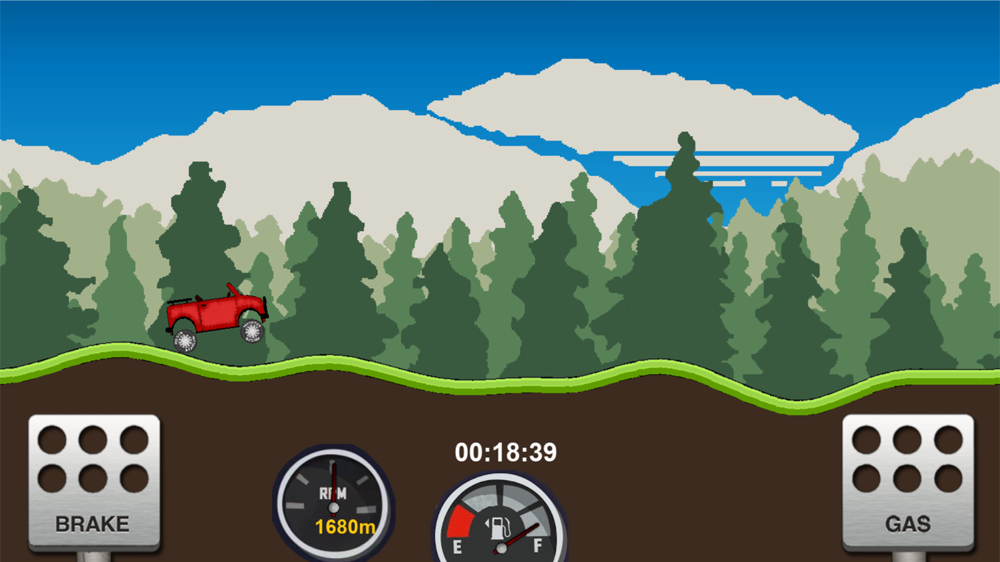
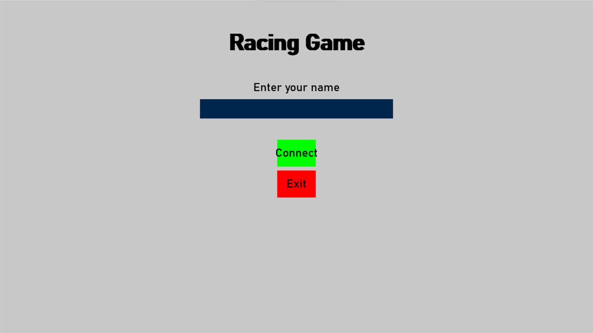
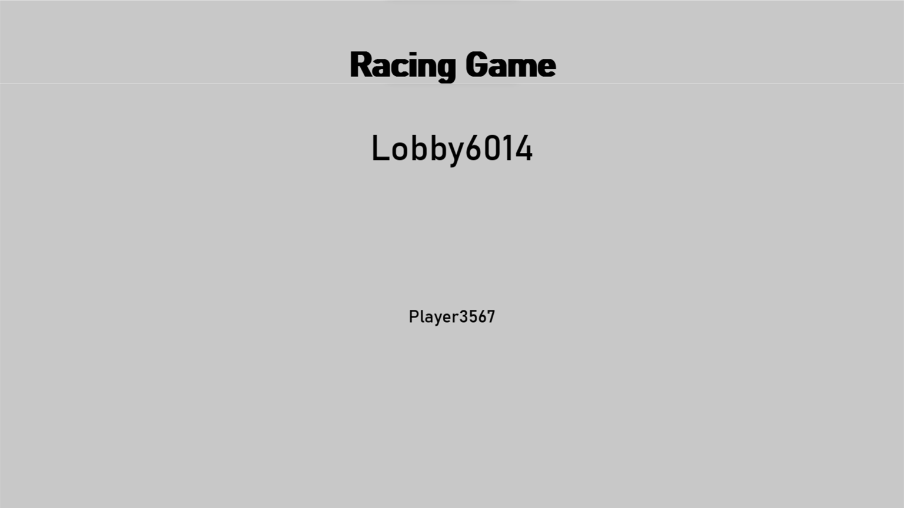

# Multiplayer Car Game

A **real-time multiplayer version** of the classic Hill Climb Racing game, developed as part of a school coursework project (April 2024).  
The project features a **custom-built  2D physics engine**, real-time multiplayer over a **local network**, and car simulation.

---

## Gameplay Preview

### In-Game

### Main Menu

### Lobby Screen

---

## Features

- **Custom Physics Engine** — Built entirely from scratch to simulate rigidbodys.  
- **Simulated Car Physics** — A simulated tire model with slip using Pacejka's magic formula.
- **Local Multiplayer Support** — Race against others connected to the same local network.  
- **Proceduarl Terrain** — Randomly generated terrain using perlin noise.  

---

## How to Run

1. Run the `server.py` file on the **host computer**.  
2. Copy the **IPv4 address** displayed in the server console.  
3. Open the `settings.txt` file and **paste the IP address** there.  
4. Run `main.py` to start the game.  

---

## Technical Notes

- Built using **Python** and completly rendered using pygame.  
- The **physics engine** was entirely hand-coded with very minimal use of external libraries.  
- Multiplayer communication uses **UDP sockets** for faster data transfer.  

---

## Future Improvements

- Add sound effects to improve gameplay.
- Add online multiplayer using servers or peer-to-peer networking.  
- Add car upgrades and muliple vehicles.
- Improve UI/UX as this is very basic at the minute.  
